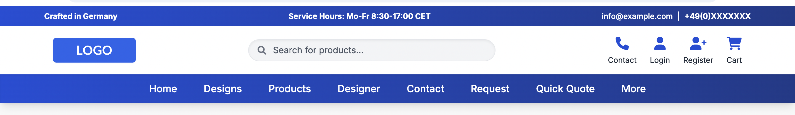

# ecommerce-header
A responsive e-commerce header built with Tailwind CSS and JavaScript, featuring a search overlay, dynamic cart modal, and clean UI design.

# 🛒 Responsive E-Commerce Header with Search & Cart (Tailwind CSS + JavaScript)

This project is a fully responsive, modern e-commerce website header built using **HTML**, **Tailwind CSS**, and **Vanilla JavaScript**. It includes:

- ✅ A clean navigation bar with logo, links, and contact info
- 🔍 An animated **search overlay** with live product filtering
- 🛒 A **cart modal** with item rendering, totals, and badge count
- 🔔 Notification pop-ups
- ✨ Smooth transitions and modern UI components

### 🧰 Technologies Used

- [Tailwind CSS](https://tailwindcss.com/)
- [Font Awesome](https://fontawesome.com/)
- Google Fonts (Inter)
- Vanilla JavaScript (no frameworks)

